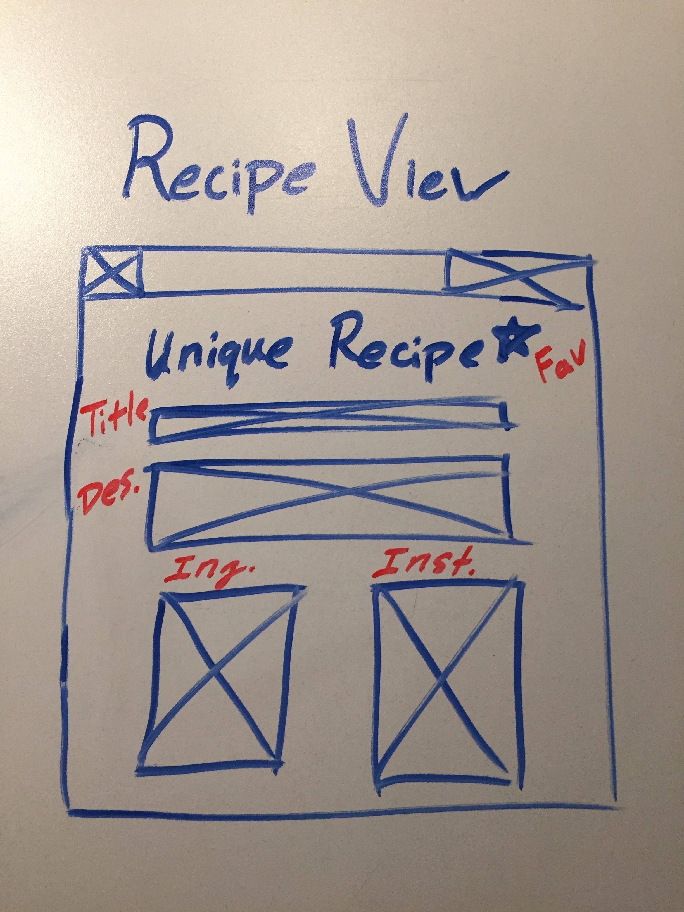

## Project 4

<a href="https://trello.com/b/qLBdKunb/project-4">Trello Board</a>

#### Description
This project will be an aggregator for recipes for cooking! It will incorporate an external API that users can then search, favorite, comment, and use. 

It will incorporate one full CRUD model for users and additional features mentioned above. I would also like to trya and make an attempt at creating a SPA. 

I would like to attempt to make this mobile so I will make my API seperate and use Angular for this project. 

#### Stretch

I eventually want to implement custom recipes that users can create themselves and other users can create. I also want to implement comments and rating on recipes as well, so users can share their experiences. 

MAJOR STRETCH GOAL is to connect with Gus' API 😏 and have his users custom recipes searchable on my website. 

#### Technologies 
<ul>
<li>MEAN Stack</li>
<li>HTML</li>
<li>CSS</li>
<li>JavaScript</li>
</ul>

#### Installation Instructions

1. Clone/fork repo into your workspace
2. Navigate locally to the repository and into the api directory 
`$ cd ~/project4/api`
3. Install all the dependencies from the package json  
`$ npm install`
4. Run the backend server  
`$ nodemon`
5. Navigate back to the root and into the frontend directoy 
`cd ../frontend`
6. Run server and the page will run in your default browser 
`$ server`

#### ERD

#### Wireframe

