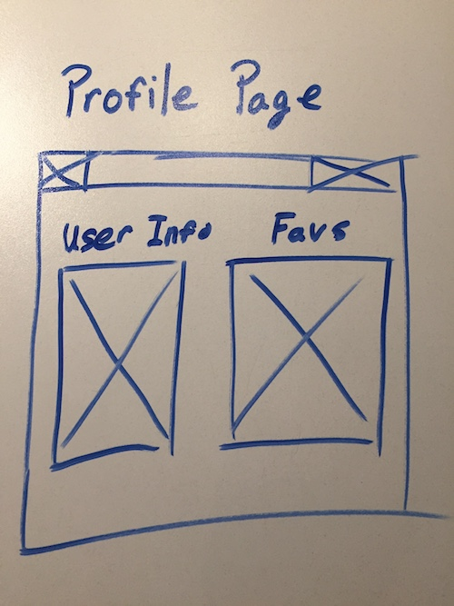

## Project 4

<a href="https://trello.com/b/qLBdKunb/project-4">Trello Board</a>

#### Description
This project is an aggregator for recipes for cooking! It will incorporates Mise's external API (thanks Gus!) that users can then view and favorite to their profile to save for later.

It will incorporates one full CRUD model for users and additional features mentioned above. This web app is also a SPA.

#### Stretch

I eventually want to implement custom recipes that users can create themselves and other users can create. I also want to implement comments and rating on recipes as well, so users can share their experiences.

By the meet and hire I would also like to transfer this into a mobile app. 

#### Technologies
<ul>
<li>MEAN Stack</li>
<li>HTML</li>
<li>CSS</li>
<li>JavaScript</li>
<li>JWTs</li>
<li>Heroku</li>
</ul>

#### Installation Instructions

1. Clone/fork repo into your workspace
2. Navigate locally to the root directory 
`$ cd ~/project4`
3. Create you own .env file in the root of the project and enter a token secret like below. 
'TOKEN_SECRET={YOUR SECRET}'
4. Install all the dependencies from the package json  
`$ npm install`
5. Run nodemon  
`$ nodemon`
6. Open your default browser and navigate to http://localhost:3000 

#### ERD

#### Wireframe

